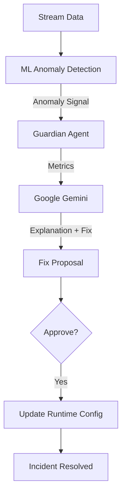

# Data Pipeline Guardian 🛡️

**An Autonomous Agentic System for Self-Healing Data Pipelines.**

This project demonstrates an **AI-powered reliability agent** ("Guardian") that monitors data streams, detects anomalies, diagnoses root causes using LLM reasoning (Google Gemini), and proposes interactive remediation fixes.

## 🚀 Key Features

*   **Real-time Anomaly Detection**: Uses **Isolation Forest** (ML) to detect deviations in volume, null rates, and latency.
*   **LLM-Powered Diagnosis**: Uses **Google Gemini 2.5 Flash** to analyze incident metrics and explain root causes in simple, natural language.
*   **Interactive Remediation**: Proposes configuration fixes (e.g., adjusting watermarks) and waits for **Human-in-the-Loop** approval.
*   **Simulated Fix Execution**: Safely simulates the application of fixes by updating runtime configuration in memory, demonstrating immediate incident resolution without mutating source code.
*   **End-to-End Demo**: A self-contained simulation (`pipeline.demo_run`) that plays back a realistic "Late Data" incident scenario.

## 🛠️ Setup & Installation

### 1. Prerequisites
*   Python 3.8+
*   Google Gemini API Key (Free Tier is sufficient)

### 2. Install Dependencies
```bash
pip install pandas scikit-learn google-generativeai
```

### 3. Configure API Key
Open `agent/guardian_agent.py` and `agent/fix_generator.py` (or set via environment variable in a production setup) to configure your key:
```python
api_key = "YOUR_GEMINI_API_KEY"
```

## ▶️ Usage (The Demo)

Run the end-to-end simulation to see the Guardian in action:

```bash
python -m pipeline.demo_run
```

**What to expect:**
1.  **Data Generation**: The system aggregates raw transaction data.
2.  **Streaming**: It simulates processing 5-minute windows.
3.  **Incident**: A "Late Data" anomaly is detected.
4.  **Diagnosis**: The Guardian explains the issue (LLM-generated).
5.  **Proposal**: A fix is proposed (e.g., "Increase Watermark").
6.  **Action**: You type `y` to approve.
7.  **Resolution**: The pipeline immediately recovers as the simulated fix takes effect.

## 📂 Project Structure

*   `pipeline/`: Core ETL simulation logic.
    *   `stream_simulator.py`: Main playback engine.
    *   `demo_run.py`: Entry point for the demo.
    *   `runtime_config.py`: Mutable configuration for simulated fixes.
*   `agent/`: The "Brain" of the system.
    *   `guardian_agent.py`: Orchestrates diagnosis (Rules + Gemini).
    *   `fix_generator.py`: Generates fix proposals using Gemini.
    *   `rule_engine.py`: Deterministic logic for severity assignment.
    *   `prompts.py`: Optimized LLM prompts.
*   `ml/`: Anomaly detection models.
    *   `detect_anomaly.py`: Isolation Forest inference.
*   `data/`: Synthetic datasets for training and scenarios.

## 🧠 Architecture



---
*Built for the "Self-Healing Data Pipeline" Prototype.*
